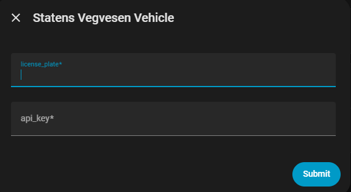

# Statens Vegvesen Vehicle – Home Assistant Integration

A Home Assistant custom integration that retrieves vehicle information from the Statens Vegvesen Autosys API.

The integration allows Home Assistant to display detailed information about Norwegian registered vehicles using the public data services provided by Statens Vegvesen.

This includes vehicle specifications, registration status, EU control (PKK) deadlines, and other technical vehicle data.

This project is not affiliated with, endorsed by, or supported by Statens vegvesen.

---

## Features

- Vehicle device in Home Assistant
- Support for multiple vehicles
- EU control (PKK) deadline and countdown
- 80+ automatically generated sensors including:
  - vehicle dimensions
  - weights
  - drivetrain data
  - environmental data
  - seating capacity
  - technical approval data
- Manual refresh service
- Clean entity naming and device registry support
- Polling the API every 12 hours

---

## Data Source

This integration retrieves vehicle data from the public APIs provided by:

Statens vegvesen (Norwegian Public Roads Administration)

The data originates from the Autosys vehicle registry.

Official website:
https://www.vegvesen.no

API documentation:
[https://autosys-kjoretoy-api.atlas.vegvesen.no/](https://autosys-kjoretoy-api.atlas.vegvesen.no/api-ui/index-api.html?apiId=enkeltoppslag)

---

## Installation

### HACS (recommended)

1. Open HACS in Home Assistant
2. Add this repository as a Custom Repository
3. Install **Statens Vegvesen Vehicle**
4. Restart Home Assistant
5. Add the integration through **Settings → Devices & Services**

### Manual installation

Copy the folder into your Home Assistant configuration directory.

Restart Home Assistant afterwards.

---

## Configuration

After installation, add the integration through the Home Assistant UI.

You will be prompted to enter a Norwegian vehicle registration number and API key.

The API key is provided by Statens Vegvesen services: 
[Staten vegvesen API key](https://www.vegvesen.no/fag/teknologi/apne-data/et-utvalg-apne-data/api-for-tekniske-kjoretoyopplysninger/)

Multiple vehicles are supported.

---

## API Key

This integration uses the public vehicle data APIs provided by Statens vegvesen.

Access to these APIs may require an API key obtained from Statens vegvesen.

Users are responsible for obtaining and managing their own API keys in accordance with the terms and conditions defined by Statens vegvesen.

The maintainers of this integration are not responsible for:

- revoked or expired API keys
- API rate limits or throttling
- blocked API access due to excessive usage
- changes to authentication requirements

Users must ensure that their API keys are kept secure and are not shared publicly.

Any use of the API must comply with the usage policies defined by Statens vegvesen.

API keys should never be committed to public repositories or shared in logs.

---

## Entities

Each vehicle will appear as a device in Home Assistant and will automatically generate sensors based on the data returned from the Autosys API.

Typical entities include:

- EU control deadline
- EU control days remaining
- vehicle weight
- maximum payload
- dimensions
- drivetrain information
- WLTP range (for electric vehicles)

The exact sensors depend on the vehicle data available in the API.

---

## Example Sensors

The Statens vegvesen APIs return data in **Norwegian**, and this integration preserves that naming in Home Assistant.  
Because the API structure itself is Norwegian, the generated sensors and entities will also appear in Norwegian.

The integration automatically maps and exposes most available fields returned by the API as sensors.  
Depending on the vehicle, this typically results in **hundreds of sensors** describing technical specifications, approval data, and vehicle metadata.

Below is a small subset of example sensors.

| Sensor | Example Value |
|------|------|
| Akslinger Antall Aksler | 2 |
| Bremser Abs | True |
| Dimensjoner Bredde | 1,823 mm |
| Dimensjoner Høyde | 1,472 mm |
| Dimensjoner Lengde | 4,556 mm |
| Drivstoff Drivstoff Kode Kode Beskrivelse | Diesel |
| Drivstoff Drivstoff Kode Kode Navn | Diesel |
| EU Kontroll Dager Igjen | 423 |
| Periodisk Kjøretøy Kontroll Kontrollfrist | 2027-05-03 |
| Periodisk Kjøretøy Kontroll Sist Godkjent | 2025-03-25 |
| Persontall Sitteplasser Foran | 2 |
| Persontall Sitteplasser Totalt | 5 |
| Vekter Egenvekt | 1,344 kg |
| Vekter Egenvekt Minimum | 1,287 kg |
| Vekter Nyttelast | 481 kg |
| Vekter Tillatt Taklast | 75 kg |
| Vekter Tillatt Tilhengervekt Med Brems | 1,200 kg |
| Vekter Tillatt Tilhengervekt Uten Brems | 680 kg |
| Vekter Tillatt Totalvekt | 1,900 kg |
| Vekter Tillatt Vertikal Koplingslast | 75 kg |
| Vekter Tillatt Vogntogvekt | 3,100 kg |

⚠️ **Note:**  
The list above only shows a small subset of the available sensors.  
The integration automatically generates sensors for most fields returned by the Statens vegvesen API, so the exact sensors may vary depending on the vehicle.

---

## Services

The integration provides a manual refresh service:

This forces an immediate update of all configured vehicles.

---

## Disclaimer

This project is an independent open-source project and is **not affiliated with, endorsed by, or supported by Statens vegvesen**.

All vehicle data is retrieved from public APIs provided by Statens vegvesen.

The maintainers of this integration provide the software **as-is**, without any guarantees or warranties of any kind.

The maintainers of this project are not responsible for:

- inaccuracies or errors in the source data
- availability, reliability, or changes to the Statens vegvesen APIs
- API key misuse or exposure
- revoked or blocked API access
- interruptions in service
- incorrect or outdated vehicle information
- misuse of the information provided by this integration
- failures or unintended behaviour in Home Assistant automations
- damage to, or malfunction of, a Home Assistant instance or related systems
- data loss, configuration loss, or system instability
- any direct or indirect damages resulting from the use of this integration

Vehicle information provided through this integration **must not be relied upon for legal, safety, regulatory, or financial decisions**.

For official and legally binding information about vehicles, always consult the official services provided by Statens vegvesen.

By installing or using this integration you acknowledge that you do so **entirely at your own risk**.

---

## Privacy

This integration only retrieves publicly available vehicle data based on the vehicle registration number provided by the user.

No personal information is collected, stored, or transmitted by this integration beyond the API request required to retrieve vehicle data.

---

## License

This project is licensed under the MIT License.

See the LICENSE file for details.

---

## Contributing

Contributions, bug reports, and feature requests are welcome.

Please open an issue on GitHub if you encounter problems or have suggestions for improvements.

---

## Acknowledgements

Vehicle data is provided by Statens vegvesen through their public APIs.

Home Assistant is an open source project maintained by the Home Assistant community.

